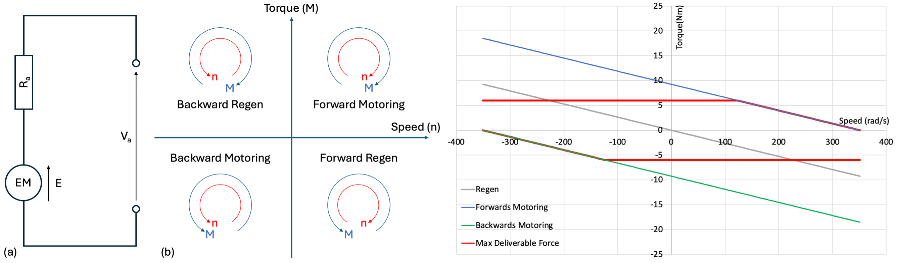
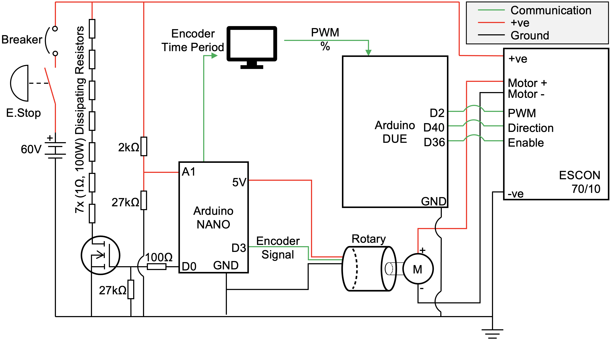
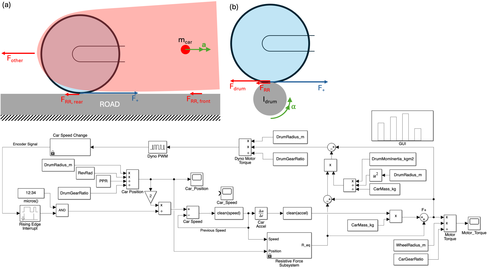
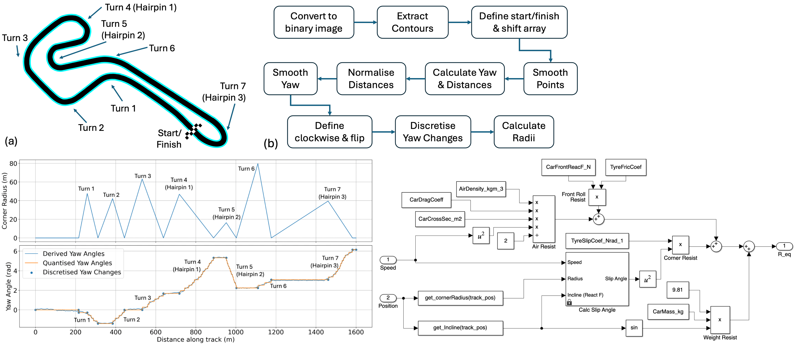
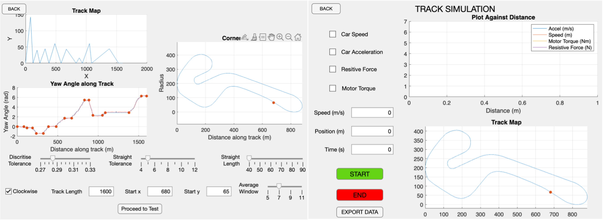

# IEM-dyno
 Final Year Project - Holistic Evaluation Tool of Imperial Eco Marathon (IEM) competition car. 
 This Project is comprised of four main objectives:
- Motor Control, Analysis
- Inertia Scaling - Momentum scaling between a car on a dynamometer (dyno) and a car on track
- Track Analysis - Elevation and Cornering
- GUI Development

These objectives were met using the working principles of a dyno, which measure the power output of the vehicle by simulating real-world driving conditions in a controlled environment. This dyno allows the IEM team to assess drivetrain performance and refine energy management strategies. By applying controlled resistive forces, the dyno replicates track conditions, helping to optimise power efficiency and overall vehicle performance.

 ## Motor Control, Analysis
The forces experienced were achieved through a combination of regenerative braking, acceleration, and plugging. Regenerative braking allows the vehicle to recover energy during deceleration, which can then be reused to improve efficiency. Plugging, a technique used to bring the motor to a rapid stop, involves applying reverse voltage to oppose rotation. The four-quadrant (4Q) plot, shown in Figure 4(a), illustrates the different modes of motor operation: forward motoring, reverse motoring (plugging), forward regeneration, and reverse regeneration.

The overall system is controlled using an Arduino Nano for interrupt-driven monitoring of the battery state of charge (SOC) to prevent overcharging of the battery, and an Arduino Uno to manage pulse-width modulation (PWM) signals to the motor controller, ensuring precise speed and torque control.

 ## Inertia Scaling
Inertia scaling is crucial to ensure the dynamometer accurately replicates the car's acceleration profile. The control system applies force proportionally to simulate real track conditions by adjusting for differences in inertia between the car and the dyno drum. The equations used relate the forces experienced on track with those applied on the dyno, ensuring realistic testing scenarios.

 ## Track Analysis
Track forces are derived from an analysis of elevation changes and cornering forces. Elevation changes introduce gravitational potential energy (GPE) variations, which affect power consumption. Cornering forces arise due to tyre deformation and reaction forces, impacting the vehicle's efficiency and stability. These are assessed using image processing techniques to extract track elevation and radius data for accurate simulation.

 ## GUI Development
The MATLAB-based GUI consists of two pages, providing full customisation of physical parameters such as vehicle mass, wheel radius, and track properties. The interface facilitates ease of use, offering real-time data visualisation and parameter adjustments to optimise testing and evaluation.

 ## Testing
This image shows the dyno and complete circuit working with the IEM team, evaluating powertrain efficiency and strategy refinement.
