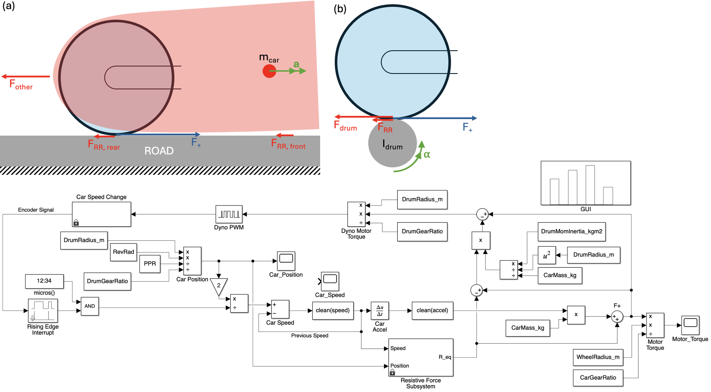

# IEM-dyno
 Final Year Project - Holistic Evaluation Tool of Imperial Eco Marathon (IEM) competition car. 
 This Project is comprised of four main objectives:
- Motor Control, Analysis
- Inertia Scaling - Momentum scaling between a car on a dyno and a car on track
- Track Analysis - Elevation and Cornering
- GUI Development

 ## Motor Control, Analysis

 ## Inertia Scaling

 ## Track Analysis

 ## GUI Development

